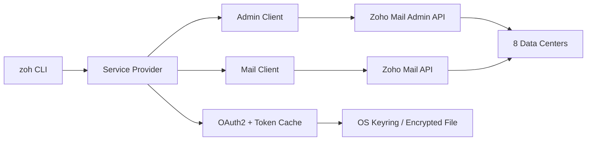

# zohcli

A fast, scriptable CLI for Zoho Mail and Admin APIs. Manage users, groups, domains, email, and audit logs from your terminal.

```
zoh admin users list
zoh mail messages search --from boss@company.com --unread
zoh send --to team@company.com --subject "Deploy done" --body "v2.1 is live"
```

## Features

- **Full Zoho Mail API** — folders, labels, messages, search, threads, attachments, send/reply/forward
- **Full Zoho Admin API** — users, groups, domains, email alias management, audit logs, login history, SMTP logs
- **Mail administration** — spam filters, retention policies, delivery logs
- **8 data centers** — `us` `eu` `in` `au` `jp` `ca` `sa` `uk`
- **Multiple output formats** — JSON (scriptable), plain (pipeable), rich (interactive tables)
- **OAuth2 authentication** — browser-based or manual paste for headless/SSH environments
- **Shell completion** — bash, zsh, fish
- **Secure credential storage** — OS keyring or encrypted file (auto-detected for WSL/headless)
- **Agent-friendly** — stable exit codes, `--results-only` JSON, `zoh schema` introspection

## Architecture



## Install

```bash
go install github.com/SeMmyT/zohcli@latest
```

Or download a binary from [Releases](https://github.com/SeMmyT/zohcli/releases).

## Setup

1. Create a **Server-based** app at [api-console.zoho.com](https://api-console.zoho.com) (or your region's equivalent)
2. Set the redirect URI to `http://localhost:8080/callback`
3. Configure the CLI:

```bash
zoh config set client_id YOUR_CLIENT_ID
zoh config set client_secret YOUR_CLIENT_SECRET
zoh config set region eu   # optional, defaults to us
```

4. Log in:

```bash
zoh auth login          # opens browser
zoh auth login --manual # paste mode for SSH/headless
```

## Usage

### Quick shortcuts

```bash
zoh send --to user@example.com --subject "Hi" --body "Hello"
zoh ls users
zoh ls groups
zoh ls folders
```

### Admin

```bash
# Users
zoh admin users list
zoh admin users list --all --output json
zoh admin users get user@example.com
zoh admin users create new@example.com --first-name Jane --role admin
zoh admin users deactivate user@example.com --block-incoming --dry-run

# Groups
zoh admin groups list
zoh admin groups create "Engineering" --email eng@example.com
zoh admin groups members add eng@example.com alice@example.com bob@example.com

# Domains
zoh admin domains list
zoh admin domains add example.com
zoh admin domains verify example.com --method txt

# Aliases
zoh admin users aliases list user@example.com
zoh admin users aliases add user@example.com alias1@example.com alias2@example.com
zoh admin users aliases remove user@example.com old-alias@example.com --force

# Audit
zoh admin audit logs --from 2025-01-01 --to 2025-01-31
zoh admin audit login-history --from 2025-01-01 --to 2025-01-31 --mode failedLoginActivity
zoh admin audit smtp-logs --from 2025-01-01 --to 2025-01-31 --search-by fromAddr --search admin@example.com
```

### Mail

```bash
# Messages
zoh mail messages list
zoh mail messages list --folder Sent --all --output json
zoh mail messages get MESSAGE_ID --folder Inbox
zoh mail messages search "quarterly report" --has-attachment --after 2025-01-01
zoh mail messages thread THREAD_ID

# Send
zoh mail send compose --to user@example.com --subject "Report" --body "See attached" --attach report.pdf
zoh mail send reply MESSAGE_ID --folder Inbox --body "Thanks!" --all
zoh mail send forward MESSAGE_ID --folder Inbox --to manager@example.com

# Attachments
zoh mail attachments list MESSAGE_ID --folder Inbox
zoh mail attachments download ATTACHMENT_ID --message-id MESSAGE_ID --folder Inbox

# Settings
zoh mail settings signatures list
zoh mail settings vacation set --from "01/01/2025 00:00:00" --to "01/15/2025 23:59:59" --subject "OOO" --content "Back Jan 16"
zoh mail settings display-name set "Jane Doe"
zoh mail settings forwarding get
```

### Mail Admin

```bash
zoh mail admin spam categories
zoh mail admin spam get --category allowlist-domain
zoh mail admin spam update --category blocklist-email --values spammer@example.com
zoh mail admin logs --limit 100
zoh mail admin retention get
```

## Global flags

| Flag | Description |
|------|-------------|
| `--region` | Zoho data center (`us`, `eu`, `in`, `au`, `jp`, `ca`, `sa`, `uk`) |
| `--output`, `-o` | Output format: `json`, `plain`, `rich`, `auto` |
| `--results-only` | Strip JSON envelope, return data array only (requires `--output json`) |
| `--verbose`, `-v` | Verbose output |
| `--dry-run` | Preview without executing |
| `--force` | Skip confirmation prompts |
| `--no-input` | Fail instead of prompting |

All flags support environment variables: `ZOH_REGION`, `ZOH_OUTPUT`, `ZOH_VERBOSE`, etc.

## Scripting

```bash
# Pipe JSON to jq
zoh admin users list --output json --results-only | jq '.[].primaryEmailAddress'

# Export all messages as JSON
zoh mail messages list --all --output json --results-only > messages.json

# Machine-readable command tree
zoh schema
zoh schema admin users
```

## Exit codes

| Code | Meaning |
|------|---------|
| 0 | Success |
| 1 | General error |
| 2 | Config error |
| 3 | Usage error |
| 4 | Auth error |
| 5 | API error |
| 6 | Not found |

## Shell completion

```bash
zoh completion install        # auto-detects shell
zoh completion install --shell zsh
```

## License

[MIT](LICENSE)
